# Objetivos del proyecto
###  Este proyecto de flask contiene la creacion de una API para facilitar informacion del tiempo, haciendo un CRUD, completo con una base de datos de SqLite


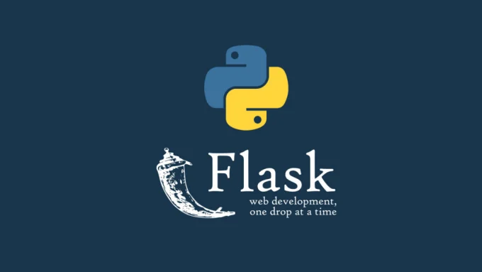


Aparte de los objetivos aportados por el  proyecto_flask_1, anteriormente comentado, hay otros elementos especificos propios de una arquitectura mas amplia que reseñamos aqui


La base de datos de weather.db se ha generado con una interfaz DB Browser, y esta es una captura de pantalla de su configuracion inicial

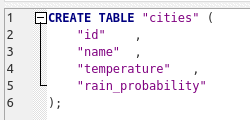

#  - Mostrar las conexiones de la capa de gestion del CRUD de datos con una base de datos, en formato SQL
En este cso se muestra tanto la variedad de **metodos** utilizados asi como la **sintaxis** que en cada caso se utiliza


###  Facilitar material funciones y propuestas para realizar test con respecto a las funciones de gestion de la base de datos en SqLite


##  Mostrar un archivo app.py con las funciones routes, que crean los endpoints y reciben las peticiones http
Se envian las ordenes a traves de una segmentacion de funciones que se llaman entre si, en diferentes archivos


# - Permitir utilizar una herramienta que permita testar las distintas peticiones para comprobar asi su fucionamiento y su eficacia de planificacion
 Comprobar a traves de Postman las peticiones que se hacen, añadiendo al body de la request los elementos propios de un POST o de un PUT

- Peticion por GET recogiendo la respuesta del directorio raiz

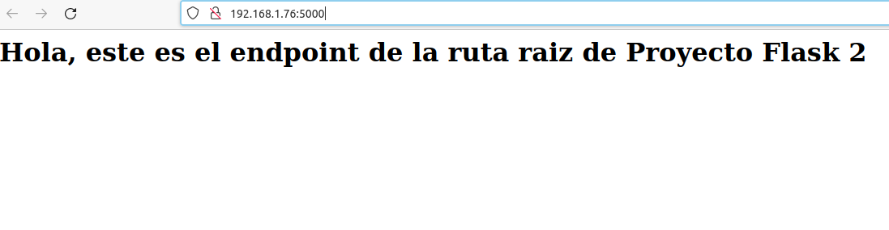

---

- Peticion por GET recogiendo todos los valores

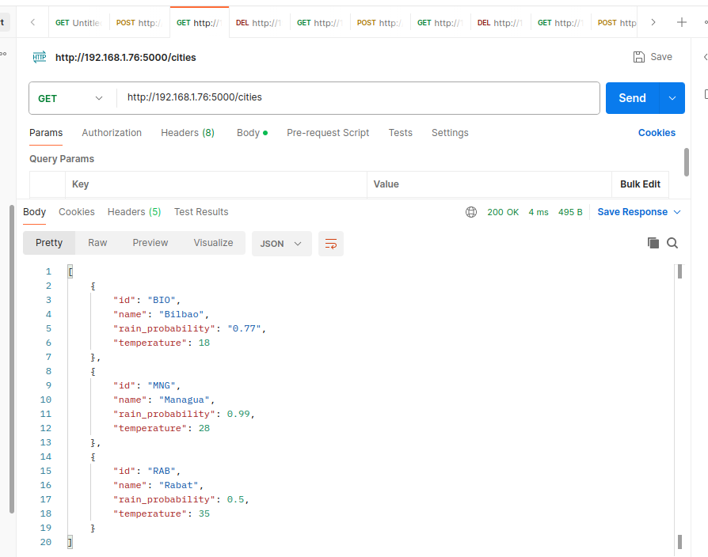

---

- Peticion por GET recogiendo el valor de un elemento, a traves de un id, el de Managua MNA

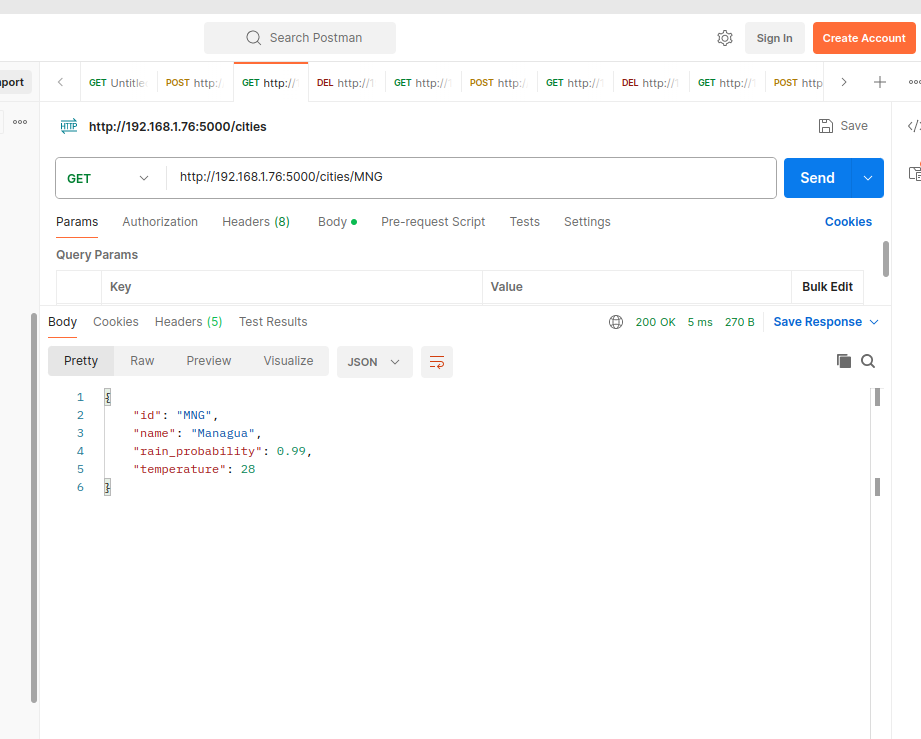


---
- Peticion por POST mandando a traves del body de la peticion un nuevo elemento (NAR, aeropuerto de Narita, en Tokio)

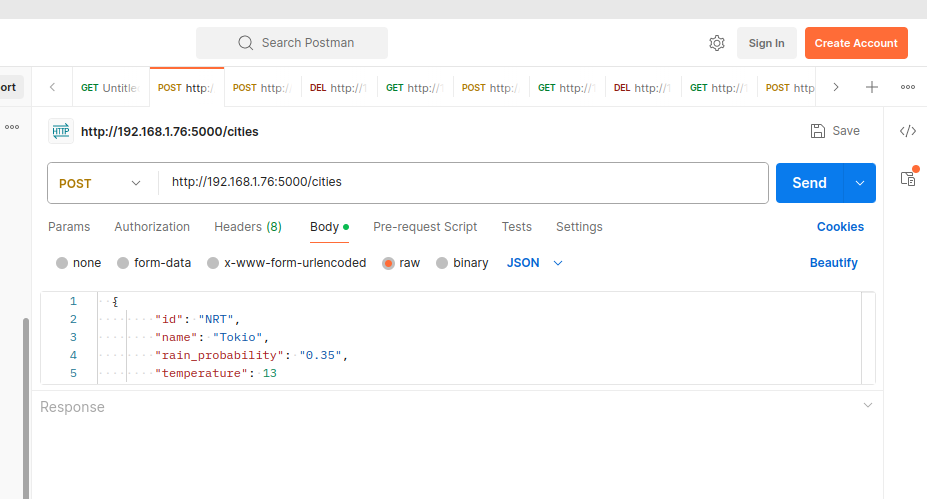

---

- Peticion por GET mostrando el resultado favorable de la inclusion por POST, de un nuevo elemento NAR

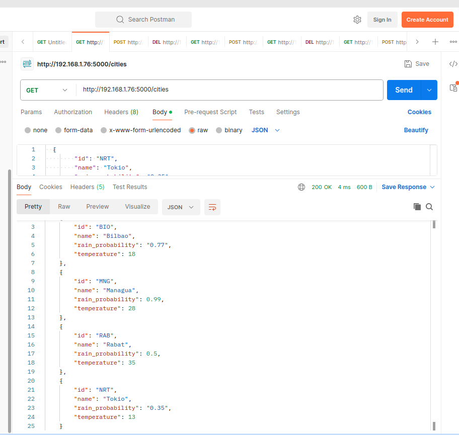

---

- Peticion por PUT  mandando a traves del body de la peticion un nuevo elemento (NAR, aeropuerto de Narita, en Tokio), modificando la temperatura a
un valor de 133

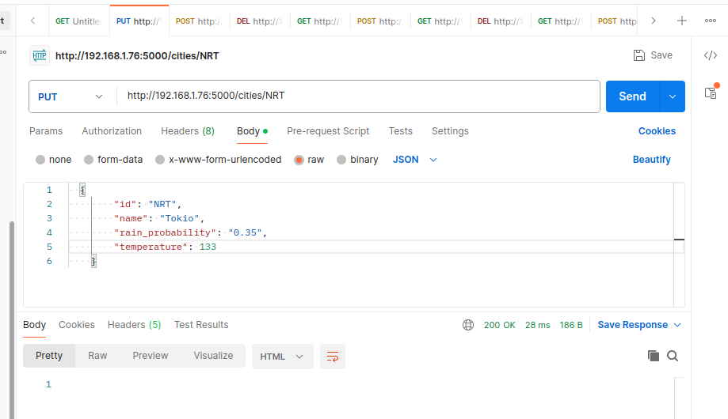

---

- Peticion por GET mostrando el resultado favorable de la actualizacion por PUT, de la temperatura del elemento NAR

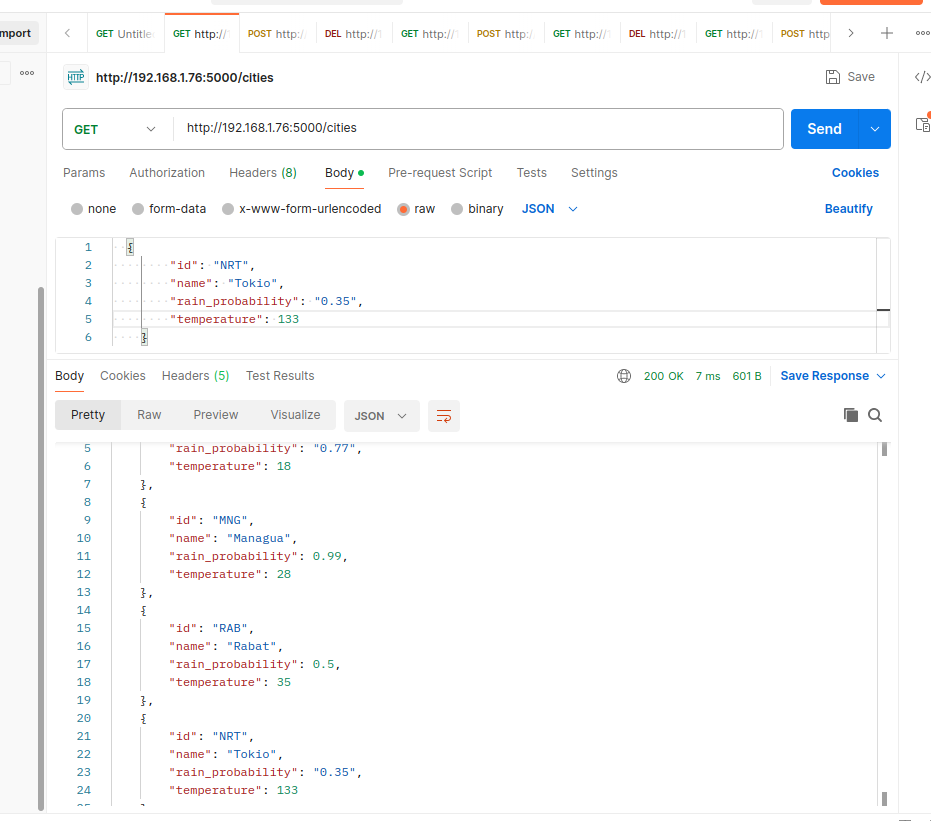

---


- Peticion por DELETE  del borrado del elemento NAR

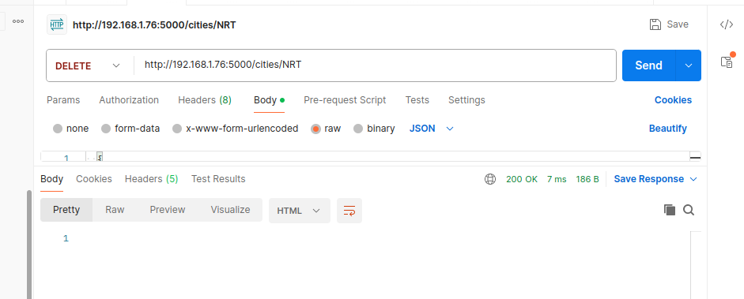

---

- Peticion por GET mostrando el resultado del borrado por DELETE del elemento NAR

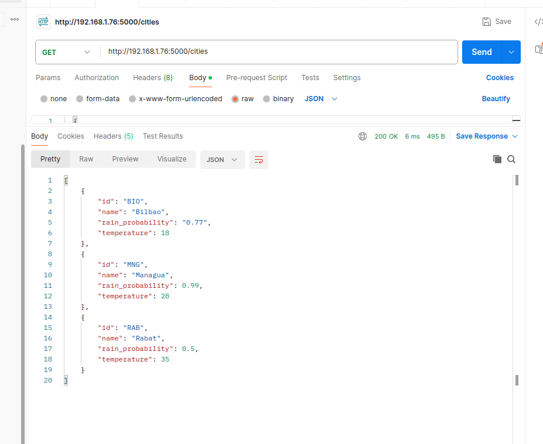

---

# - Mostrar como se utilizar el archivo requirements.txt para reseñar las dependencias utilizadads en el proyecto, respetando la sintaxis de escritura


Crea requirements.txt con la lista de paquetes
~~~
python -m pip freeze > requirements.txt 
~~~
Incluye paquetes de python como pip,...
~~~
python -m pip freeze --all > requirements.txt 
~~~
Instala paquetes listados en requirements.txt
~~~
pip install -r requirements.txt
~~~


# Requisitos de instalacion y puesta en marcha
Una vez hecho git clone, es posible que en el equipo de destino sea necesario instalar el paquete de flask_cors, para que las importaciones de este proyecto se puedan utilizar en una maquina que ya lo tenga instalado


Para poder arrancar el servidor de desarrollo, el comando es mas preciso al nombrar la version mas completa
~~~
python3.10 app.py
~~~

Al mismo tiempo que se procesan las distintas instrucciones derivadas de los endpoints, ejecutando las funciones asociadas a los decoradores routes, los distintos efectos de los procesos se pueden observar en la linea de comandos. Son informacion de lo que estamos ejecutando y muchas veces indicacion del porque se producen determinados fallos
E incluso contienen efectos buscados a traves de instrucciones print(), en las funciones de las distintas rutas, para hacer un sequimiento de los procesos desde la linea de comandos. Ejemplo: print ('**newcity', data),


# Resolver la incidencia de un puerto de conexion que se encuentra ocupado
En ocasiones interesa saber cual es el PID (Identificador del proceso) que ha generado el puerto de conexion ocupado. Localizarlo, matar el proceso y liberar el puerto
lsof -i:puerto enseña que proceso está usando este puerto
~~~
lsof-i:5000 
~~~

kill PID mata el proceso con ID => PID
~~~
kill 12345 
~~~

# CORS
Para habilitar CORS en una aplicación Flask, puedes utilizar la extensión Flask-CORS. Aquí tienes los pasos para instalar y configurar Flask-CORS en tu aplicación:

1. Instala Flask-CORS utilizando pip:
   
   ```
   pip install flask-cors
   ```

2. Importa la extensión `CORS` en tu aplicación Flask:

   ```python
   from flask import Flask
   from flask_cors import CORS
   ```

3. Crea una instancia de tu aplicación Flask:

   ```python
   app = Flask(__name__)
   ```

4. Configura Flask-CORS para habilitar CORS en tu aplicación:

   ```python
   cors = CORS(app)
   ```

   Esto habilitará CORS en todos los endpoints de tu aplicación Flask con la configuración predeterminada. Si deseas personalizar las opciones de CORS, puedes hacerlo pasando parámetros adicionales a la instancia de `CORS`. Por ejemplo:

   ```python
   cors = CORS(app, resources={r"/api/*": {"origins": "http://example.com"}})
   ```

   Aquí se configura CORS para permitir solo solicitudes desde `http://example.com` en cualquier endpoint que comience con `/api/`.

Con estos pasos, tendrás CORS habilitado en tu aplicación Flask. Esto permitirá que las solicitudes AJAX desde dominios diferentes accedan a tu API. Asegúrate de entender y ajustar la configuración de CORS según tus necesidades de seguridad y acceso.